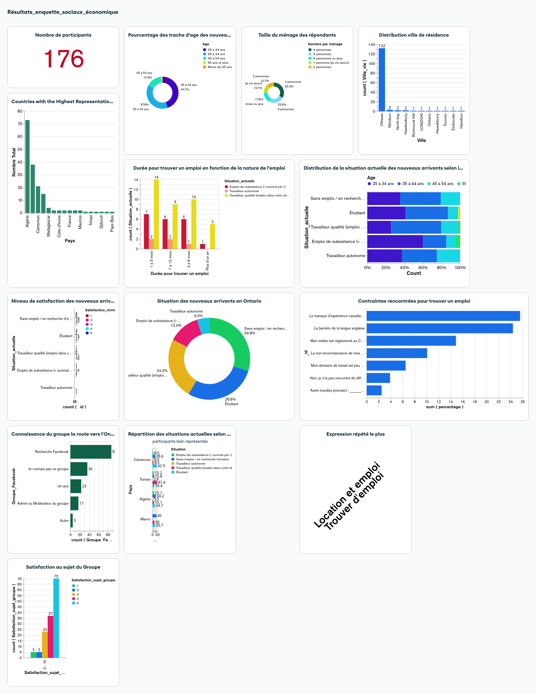

# Yazid Aloui – Data Analyst & Aspiring Data Scientist

📍 Ottawa, Ontario  
📧 alouiyaz78@gmail.com | 📞 514-242-7895  
[LinkedIn](https://www.linkedin.com/in/yazidaloui/) | [GitHub Portfolio](https://github.com/alouiyaz78)

---

## About Me
Bilingual Data Analyst and aspiring Data Scientist with strong foundations in **mathematics, machine learning, neural networks, and statistical analysis**. Experienced in **SQL, Python, NoSQL (MongoDB), Power BI, and data visualization tools**, with a proven record of managing, cleaning, and analyzing complex datasets. Passionate about applying **data-driven insights** to real-world problems and building innovative solutions.

Currently advancing my skills through **academic projects at Collège La Cité** (January 2025 – Ongoing) and professional online training in **Machine Learning and AI (Formation ML-Pro, UK)**. Experienced in full project lifecycles from **data collection to model deployment**.

---

## Skills
- **Programming & Data Tools:** Python ( advanced), SQL (advanced), MongoDB, Power BI(advanced), Tableau, Excel(advanced),Java  
- **Machine Learning & Statistics:** Classification, Regression, Neural Networks, Inferential Statistics  
- **Web & Cloud:** Flask, HTML(basic), CSS(basic), JavaScript(basic), AWS(basic), Azure basics(basic)  
- **Data Handling & Automation:** APIs, Data Cleaning, Data Pipelines, Python automation, Power Automate  
- **Version Control & Collaboration:** Git, GitHub  
- **Languages:** French (Fluent), English (Intermediate, actively improving)  

---

## Education
- **Applied Data Science** – Collège La Cité, Ottawa, ON | Jan 2025 – Ongoing  
- **Bachelor’s Degree in Mathematics** – Faculty of Sciences, Bizerte | WES Equivalence: Bachelor’s Degree (4 years)  

---

## Professional Experience

### Data Analyst – EoCube (Remote, Part-Time)  
**Tunis, Tunisia | August 2023 – November 2023**  
- Participated in **forest, pastoral, and olive inventory** with FAO and the General Directorate of Forests.  
- Managed and cleaned **large datasets** collected from field teams using **Open Foris**.  
- Supervised **data submissions from 24 field agents**, ensuring accurate, real-time updates.  
- Collaborated with experts to **validate data quality** and resolve inconsistencies.  
- Streamlined workflows with **SQL and Excel** for validation, analysis, and reporting.  

### Loan Director – Association for the Development of Menzel Jemil  
**Tunisia | October 2009 – April 2024**  
- Led development and automation of **financial tracking systems** using Python.  
- Managed a portfolio of **5,000+ clients** and conducted **quantitative analyses** for key metrics.  
- Created **IMF_PLUS**, a data analysis tool, boosting loan recovery rates by 3%.  
- Implemented management strategies achieving a **90% success rate** in recovery campaigns.  

---

## Academic Projects 

### 1. [SOS Office – Microfinance Management System](https://github.com/alouiyaz78/SOS)  
Python, SQLite, Tkinter, Pandas, ReportLab, docx2pdf  
- Desktop application for **microfinance client data management**, KPI dashboards, and automated reporting.  
- Automated **data entry, PDF/DOCX reporting**, and dynamic dashboards.  

### 2. [London Hotel Chatbot](https://github.com/alouiyaz78/Chatbot)  
Python, Flask, OpenAI, LangChain, BeautifulSoup, HTML/CSS/JS  
- Created a **custom AI chatbot** capable of responding to questions from PDFs or web content.  
- Implemented **RAG (Retrieval-Augmented Generation)** using OpenAI embeddings and FAISS vector search.  
- Developed a **frontend interface** integrated with Flask backend for real-time chat.  

### 3. [Ontario 511 API – Traffic Data Automation & Reporting](https://github.com/alouiyaz78/Project_Ontario_511)  
Python, SQL Server  
- Automated **data imports from Ontario 511 API** via Python scripts and stored procedures.  
- Created **scheduled jobs** for extraction every 2 hours, KPI calculations, and archiving obsolete events.  
- Designed **dynamic reports** and triggers for traffic monitoring, camera statuses, and construction events.

### 4. [Ontario Francophone Newcomers Survey – Socio-Economic Analysis](https://github.com/alouiyaz78/projet_enquette_sociaux)
Python, MongoDB, Power Automate, MongoDB Charts

Conducted a survey among new Francophone arrivals in Ontario to understand their socio-economic situation, integration challenges, and needs.  
Automated the data collection, cleaning, storage, and visualization pipeline.

**Key Contributions & Workflow:**
- **Data Collection & Automation:** Microsoft Forms integrated with Excel via Power Automate; 250 responses collected in two weeks with automatic notifications for the team.
- **Data Cleaning & Transformation:** Python ETL pipeline using pandas and numpy to remove duplicates, standardize location data, and convert to JSON for MongoDB.
- **Database & Storage:** Data inserted into MongoDB Atlas using pymongo for efficient storage and querying.
- **Visualization & Dashboard:** Created interactive charts (donut, bar, grouped bar) with MongoDB Charts; provided insights on employment constraints and socio-economic integration.
- **Impact & Skills Developed:** Fully automated workflow, gained expertise in Python, ETL processes, Power Automate, MongoDB, and dashboard visualization.

**Dashboard Preview:**  
 

  

---

## Online Training
- **Machine Learning Pro (ML-Pro)** – Formation ML-Pro, UK,2025
  *Modules: Python, Data Science Frameworks, SQL, ML Models, Deep Learning, Cloud, MLOps, Generative AI*  
- **IBM Data Science Certification** – Coursera, 2022  
- **Python Certification: From Fundamentals to Advanced** – University of Côte d’Azur, 2023  
- **The Complete SQL Bootcamp** – Coursera, 2023  
- **Power BI Training Certification** – Future Skills Institute, 2022  
- **Machine Learning in Python with scikit-learn** – Inria, 2025  

---

## Volunteer Experience
- **Project Manager**, Friends of the Remel Forest Association | Dec 2016 – Dec 2018  
  *Led environmental initiatives for 2,000+ residents.*  
- **Council Member & Director of Communication**, Menzel Jemil | Jul 2018 – Dec 2023  
  *Directed civic campaigns and environmental awareness initiatives.*  
- **Project “Mon Lac Mala Jaw”**, 2022-2023  
  *Field surveys and environmental awareness analysis for EU EcoPact program.*  

---

## Contact
Actively seeking **Data Analyst / Data Scientist roles** to apply technical skills, machine learning knowledge, and data visualization expertise.  
📧 alouiyaz78@gmail.com | 📞 514-242-7895 | [LinkedIn](https://www.linkedin.com/in/yazidaloui/)  

---

