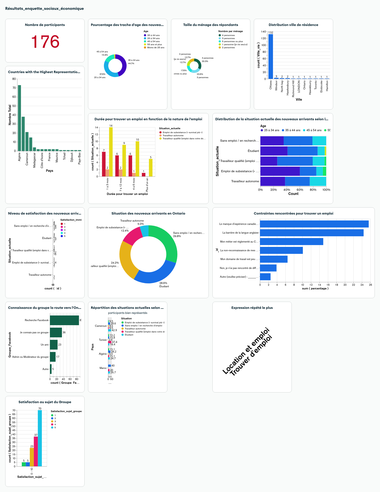

# Yazid Aloui – Data Analyst | Data Engineering & Machine Learning

Ottawa, Ontario  
alouiyaz78@gmail.com | 514-242-7895  
[LinkedIn](https://www.linkedin.com/in/yazidaloui/) | [GitHub](https://github.com/alouiyaz78)

---

## About Me
Bilingual Data Analyst (FR/EN) with a strong background in mathematics and hands-on experience in Python, SQL, BI, and data automation. I focus on building reliable data pipelines and end-to-end data products, combining Data Engineering, Machine Learning, and business-driven decision making.

---

## Skills
- **Programming & Data Tools:** Python (advanced), SQL (advanced), MongoDB, Power BI (advanced), Tableau, Excel (advanced), Java  
- **Data Engineering & Big Data:** Databricks, Delta Lake, Spark (PySpark), Hadoop (HDFS, Streaming MapReduce), ETL Pipelines  
- **Machine Learning & Statistics:** Classification, Regression, Neural Networks, Inferential Statistics  
- **MLOps & Monitoring:** Pandera, YAML validation, SHAP, Fairlearn, Evidently  
- **Web & Cloud:** Flask, HTML (basic), CSS (basic), JavaScript (basic), AWS (basic), Azure (basic)  
- **Data Handling & Automation:** APIs, Data Cleaning, Data Pipelines, Python automation, Power Automate  
- **Version Control & Collaboration:** Git, GitHub  
- **Languages:** French (Fluent), English (Intermediate, actively improving)  

---

## Education
- Applied Data Science – Collège La Cité (Ottawa), 2025 – Present  
- BSc Mathematics – Faculty of Sciences (Bizerte), WES evaluated (4 years)

---

## Experience
- **Data Analyst – EoCube (2023):** Data cleaning, validation, reporting (FAO project)  
- **Financial Analyst / Loan Portfolio Manager – Association for the Development of Menzel Jemil (2009–2024):** Financial reporting, KPI monitoring, portfolio analytics, process automation (Python)

---

## Projects

### 1. [Zero-Defect Credit Risk Pipeline](https://github.com/alouiyaz78/Zero-defect-credit-risk-pipeline)
Python | XGBoost | Pandera | YAML | SHAP | Fairlearn | Evidently | Streamlit  

End-to-end credit risk scoring pipeline with a strong focus on data quality, reliability, and business impact.

- Data quality validation using Pandera and YAML contracts  
- Feature engineering within a controlled pipeline  
- Cost-sensitive threshold optimization (FN vs FP)  
- Model explainability with SHAP  
- Fairness analysis across demographic groups  
- Data drift monitoring using Evidently  
- Interactive Streamlit dashboard for decision simulation  

🔗 Live app: https://zero-defect-credit-risk-pipeline-fxqrngtu5bmqpctnghwnqn.streamlit.app/

---

### 2. [Hadoop Mini Cluster + MapReduce KPI Dashboard](https://github.com/alouiyaz78/Hadoop_mini_cluster)
Docker | Hadoop | Spark | HDFS | Streaming MapReduce | Python | Streamlit | Plotly  

Big Data processing pipeline with automated MapReduce jobs and an interactive KPI dashboard.

---

### 3. [NYC Taxi Data ETL Pipeline – Databricks & Delta Lake](https://github.com/alouiyaz78/Databricks_project_nyct)
Databricks | Delta Lake | PySpark | Spark SQL | GitHub | VS Code  

End-to-end ETL pipeline using Medallion architecture (Landing → Bronze → Silver → Gold → Export) with incremental and historical processing.

---

### 4. [London Hotel Chatbot](https://github.com/alouiyaz78/Chatbot)
Python | Flask | OpenAI | LangChain | FAISS | Web Scraping  

AI chatbot using Retrieval-Augmented Generation (RAG) to answer questions from documents and web content.

---

### 5. [Ontario 511 API – Traffic Data Automation](https://github.com/alouiyaz78/Project_Ontario_511)
Python | SQL Server | API Automation  

Automated data ingestion pipeline with scheduled extraction and KPI reporting.

---

### 6. [Ontario Francophone Newcomers Survey](https://github.com/alouiyaz78/projet_enquette_sociaux)
Python | MongoDB Atlas | Power Automate | Dashboards  

End-to-end survey data pipeline: collection → cleaning → storage → visualization.

---

## 📊 Dashboard Preview

### Credit Risk Project

---

### Survey Project

## Certifications & Training
IBM Data Science (2022) | ML-Pro (2025) | SQL Bootcamp | Power BI | Python Advanced

---

## Contact
Open to Data Analyst / ML / Data Engineer / BI roles.  
📧 alouiyaz78@gmail.com
